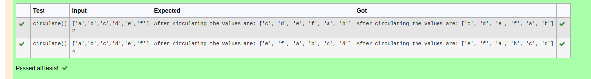

# Circulate-the-values-of-N-variables
## Aim:
To write a python program to circulate the n variables using function concept
## Equipment’s required:
PC
Anaconda - Python 3.7
## Algorithm: 
### Step 1: 
to identify circulation of the variable.
### Step 2: 
first we have define circulate
### Step 3: 
Get the value from the user for the number of rotation
### Step 4: 
Using the slicing concept rotate the list

### Step 5: 
### Step 6: 
## Program:

```#Program to circulate N values.
#Developed by: 
#RegisterNumber:
def circulate():
   a=eval(input())
   b=eval(input())
   c=a[b:]+a[:b]
   print("After circulating the values are:",c)
```
## Output:



## Result:

python program to circulate the n variables using function concept is running successfully.

